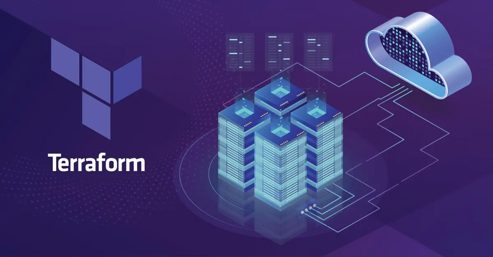

# Introduction to Terraform and IaC



---

## **What is Infrastructure as Code (IaC)?**  
**Definition:**  
Infrastructure as Code (IaC) is a method of managing and provisioning computing infrastructure using code rather than manual processes.  

**Benefits:**  
- **Repeatability:** Ensures consistent environments using the same code.  
- **Version Control:** Tracks and audits changes.  
- **Automation:** Reduces human error through automation.  

**Tools Used for IaC:**  
- **Early Approaches:** Bash scripts, Python scripts.  
- **Configuration Management:** Ansible, Chef.  
- **Infrastructure Provisioning:** Terraform, CloudFormation.  


## **Pros and Cons for IaC Tools**  

### **1. Early Approaches: Bash Scripts and Python Scripts**
#### **Pros**
- **Simplicity:** Easy to learn and use for small tasks or one-off solutions.
- **Flexibility:** Highly customizable; can be written to handle almost any task.
- **No additional dependencies:** Can run on most systems with minimal setup.
- **Wide community support:** Lots of examples and resources available online.

#### **Cons**
- **Scalability issues:** Scripts can become complex and difficult to maintain as infrastructure grows.
- **Idempotence challenges:** Ensuring repeatable outcomes requires manual effort.
- **Error-prone:** Limited safeguards against human error; misconfigurations are common.
- **Lack of state management:** No built-in way to track the state of the infrastructure.

---

## **2. Configuration Management Tools: Ansible and Chef**
### **Pros**
- **Automation focus:** Great for configuring and maintaining infrastructure once provisioned.
- **Idempotence:** Ensures consistent results across multiple runs.
- **Human-readable:** Ansible uses YAML, which is easy to read and write.
- **Agentless (Ansible):** No need to install additional agents on target machines, simplifying deployment.
- **Large ecosystem:** Extensive modules and integrations are available for various use cases.

### **Cons**
- **Not infrastructure-first:** Designed more for configuration than infrastructure provisioning.
- **Learning curve:** Chef uses Ruby-based DSL, which can be challenging for beginners.
- **Dependency on Python (Ansible):** Requires Python on the managed systems, which might not always be pre-installed.
- **State tracking limitations:** Limited ability to track the overall state of infrastructure changes compared to Terraform.

---

## **3. Infrastructure Provisioning Tools: Terraform and CloudFormation**
### **Terraform**
#### **Pros**
- **Multi-cloud support:** Works with major cloud providers and many other services.
- **Declarative syntax:** Clearly defines the desired end-state of resources.
- **State management:** Tracks infrastructure state for efficient updates.
- **Modular structure:** Reusable modules make infrastructure more manageable and scalable.
- **Open source:** Active community and extensive ecosystem.

#### **Cons**
- **State management complexity:** Requires proper handling of the state file, which can be a challenge for teams.
- **Limited on-premises support:** While improving, Terraform’s primary focus is cloud infrastructure.
- **Learning curve:** The HashiCorp Configuration Language (HCL) can take time to master.

---

### **CloudFormation**
#### **Pros**
- **AWS-native:** Deeply integrated with AWS services, offering robust support.
- **Free service:** No additional cost beyond AWS usage fees.
- **Strong security integrations:** Works seamlessly with IAM for resource access control.
- **Drift detection:** Identifies and highlights changes made out


---

## Slide 3: What is Terraform?
**Definition:**  
Terraform is an open-source tool developed by HashiCorp that allows users to define, provision, and manage infrastructure using declarative syntax.  

**Key Features:**  
- **Open-source:** Supported by a vibrant community.  
- **Declarative:** Define *what* you need, and Terraform determines *how* to create it.  
- **State Management:** Tracks infrastructure status for efficient updates.  
- **Idempotent:** Ensures consistent results when applied multiple times.  


---

## Slide 4: Key Use Cases
**Use Cases:**  
1. **Cloud Provisioning:** Automate resource creation on platforms like GCP, AWS, or Azure.  
2. **Multi-cloud Support:** Uniform provisioning across different cloud providers.  
3. **Collaboration on Shared Infrastructure:** Teams can collaborate using version-controlled infrastructure code.  

**Example Scenarios:**  
- Automating a load balancer on GCP.  
- Managing resources across AWS and GCP.  
- Synchronizing development and production environments.  


---

## Example: What is IaC?

**Definition:** IaC allows you to define infrastructure configurations in a declarative format and automate provisioning processes.  

**Example Terraform Code:**
```hcl
resource "google_compute_instance" "example" {
  name         = "test-instance"
  machine_type = "e2-medium"
  zone         = "us-central1-a"

  boot_disk {
    initialize_params {
      image = "debian-cloud/debian-10"
    }
  }

  network_interface {
    network = "default"
  }
}
